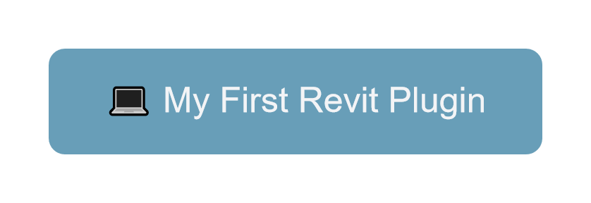

<div id="top"></div>
<!--
*** Thanks for checking out the Best-README-Template. If you have a suggestion
*** that would make this better, please fork the repo and create a pull request
*** or simply open an issue with the tag "enhancement".
*** Don't forget to give the project a star!
*** Thanks again! Now go create something AMAZING! :D
-->


<!-- PROJECT SHIELDS -->
<!--
*** I'm using markdown "reference style" links for readability.
*** Reference links are enclosed in brackets [ ] instead of parentheses ( ).
*** See the bottom of this document for the declaration of the reference variables
*** for contributors-url, forks-url, etc. This is an optional, concise syntax you may use.
*** https://www.markdownguide.org/basic-syntax/#reference-style-links
-->
[![Contributors][contributors-shield]][contributors-url]
[![Forks][forks-shield]][forks-url]
[![Stargazers][stars-shield]][stars-url]
[![Issues][issues-shield]][issues-url]
[![MIT License][license-shield]][license-url]
[![LinkedIn][linkedin-shield]][linkedin-url]


<!-- PROJECT LOGO -->
<br />
<div align="center">
  <a href="https://github.com/github_username/repo_name">
    
  </a>

<h3 align="center">Welcome to My-First-Revit-Plugin 🖐</h3>

  <p align="center">
    👨🏼‍🎓 This is an interesting project to learn more about Revit and its plugins!
    <br />
    <a href="https://github.com/github_username/repo_name"><strong>📄 Explore the docs »</strong></a>
    <br />
    <br />
    <a href="https://github.com/github_username/repo_name">🔭 View Demo</a>
    ·
    <a href="https://github.com/github_username/repo_name/issues">🐞 Report Bug</a>
    ·
    <a href="https://github.com/github_username/repo_name/issues">💡 Request Feature</a>
  </p>
</div>


<!-- TABLE OF CONTENTS -->
<details>
  <summary>🗺 Table of Contents</summary>
  <ol>
    <li>
      <a href="#about-the-project">📚 About The Project</a>
      <ul>
        <li><a href="#built-with">🔨 Built With</a></li>
      </ul>
    </li>
    <li>
      <a href="#getting-started">🚦 Getting Started</a>
      <ul>
        <li><a href="#prerequisites">❕ Prerequisites</a></li>
        <li><a href="#installation">💿 Installation</a></li>
      </ul>
    </li>
    <li><a href="#usage">⚙️ Usage</a></li>
    <li><a href="#roadmap">🛫 Roadmap</a></li>
    <li><a href="#contributing">🤝 Contributing</a></li>
    <li><a href="#license">🧾 License</a></li>
    <li><a href="#contact">☎️ Contact</a></li>
    <li><a href="#acknowledgments">💎 Acknowledgments</a></li>
  </ol>
</details>


<!-- ABOUT THE PROJECT -->
## 📚 About The Project

[![My-First-Revit-Plugin][product-screenshot]](https://github.com/kprohaszka/my-first-revit-plugin)

The aim of the following project is to learn more about uncharted territories, unfamiliar technologies and softwares.

The end goal of this project is to research and learn more about Revit and Revit Plugins and to eventually
create a Revit Plugin which draws a straight line between two given coordinates based on user input.

<p align="right">(<a href="#top">back to top</a>)</p>


### 🔨 Built With

* [C#](https://en.wikipedia.org/wiki/C_Sharp_(programming_language))
* [ASP.NET](https://dotnet.microsoft.com/apps/aspnet)
* [Revit](https://www.autodesk.com/products/revit/overview)

<p align="right">(<a href="#top">back to top</a>)</p>


<!-- GETTING STARTED -->
## 🚦 Getting Started

To use the Plugin and to get a local copy of the repository please
follow the following steps.

### ❕ Prerequisites

The following Prerequisites are needed to use the Revit Plugin:

* Revit
  ```
  [Revit Overview](https://www.autodesk.com/products/revit/overview)
  ```

### 💿 Installation

1. Clone the repo
   ```sh
   git clone https://github.com/kprohaszka/my-first-revit-plugin.git
   ```
2. Download and Install Revit
   ```
   [Revit Overview](https://www.autodesk.com/products/revit/overview)
   ```
3. Copy addin file to Revit addin directory
   ```
   C:\Program Files\Autodesk\Revit 2022\AddIns
   ```
4. Run the Revit addin
   ```
   Run Revit 2022 → Load the Addin → Add-ins tab→ External tools → Run “My-First-Revit-Plugin”
   ```

_Disclaimer: The installation path and Revit version may differ, please double check to copy it to the correct location, based on your paths and Revit version.

<p align="right">(<a href="#top">back to top</a>)</p>


<!-- USAGE EXAMPLES -->
## ⚙️ Usage

The Plugin can be used with Revit to draw a straight line (wall) between two coordinates.

_For more examples, please refer to the [Documentation](https://github.com/kprohaszka/my-first-revit-plugin/issues)_

<p align="right">(<a href="#top">back to top</a>)</p>


<!-- ROADMAP -->
## 🛫 Roadmap

- [] Learn More About Revit
- [] Research and Gather Materials on How to Make a Plugin
    - [] Sort Materials
- [] Create My First Revit Plugin

See the [open issues](https://github.com/kprohaszka/my-first-revit-plugin/issues) for a full list of proposed features (and known issues).

<p align="right">(<a href="#top">back to top</a>)</p>


<!-- CONTRIBUTING -->
## 🤝 Contributing

Contributions are what make the open source community such an amazing place to learn, inspire, and create. Any contributions you make are **greatly appreciated**.

If you have a suggestion that would make this better, please fork the repo and create a pull request. You can also simply open an issue with the tag "enhancement".
Don't forget to give the project a star! Thanks again!

1. Fork the Project
2. Create your Feature Branch (`git checkout -b feature/AmazingFeature`)
3. Commit your Changes (`git commit -m 'Add some AmazingFeature'`)
4. Push to the Branch (`git push origin feature/AmazingFeature`)
5. Open a Pull Request

<p align="right">(<a href="#top">back to top</a>)</p>


<!-- LICENSE -->
## 🧾 License

Distributed under the MIT License. See `LICENSE.txt` for more information.

<p align="right">(<a href="#top">back to top</a>)</p>


<!-- CONTACT -->
## ☎️ Contact

Konrad Prohaszka - cc.kprohaszka at gmail.com

Project Link: [https://github.com/kprohaszka/my-first-revit-plugin](https://github.com/kprohaszka/my-first-revit-plugin)

<p align="right">(<a href="#top">back to top</a>)</p>


<!-- ACKNOWLEDGMENTS -->
## 💎 Acknowledgments

* [Step-by-Step Guide to Developing your First Revit Plugin](http://aectechy.com/stepbystep-guide-to-your-first-revit-plugin/)
* [Pushing Revit to the Next Level: An Intro to Revit Plugins with C#](https://www.autodesk.com/autodesk-university/class/Pushing-Revit-Next-Level-Intro-Revit-Plugins-C-2018)
* [My First Revit Plug-in Overview](https://knowledge.autodesk.com/search-result/caas/simplecontent/content/my-first-revit-plug-overview.html)
* [Revit: Creating C# Plugins](https://www.linkedin.com/learning/revit-creating-c-sharp-plugins)
* [MyFirstPlugin](https://thebuildingcoder.typepad.com/files/revit_2013_api_my_first_plug-in_training.pdf)
* [RevitSoftware](https://www.autodesk.com/products/revit/overview?term=1-YEAR&tab=subscription)

<p align="right">(<a href="#top">back to top</a>)</p>


<!-- MARKDOWN LINKS & IMAGES -->
<!-- https://www.markdownguide.org/basic-syntax/#reference-style-links -->
[contributors-shield]: https://img.shields.io/github/contributors/kprohaszka/my-first-revit-plugin.svg?style=for-the-badge
[contributors-url]: https://github.com/kprohaszka/my-first-revit-plugin/graphs/contributors
[forks-shield]: https://img.shields.io/github/forks/kprohaszka/my-first-revit-plugin.svg?style=for-the-badge
[forks-url]: https://github.com/kprohaszka/my-first-revit-plugin/network/members
[stars-shield]: https://img.shields.io/github/stars/kprohaszka/my-first-revit-plugin.svg?style=for-the-badge
[stars-url]: https://github.com/kprohaszka/my-first-revit-plugin/stargazers
[issues-shield]: https://img.shields.io/github/issues/kprohaszka/my-first-revit-plugin.svg?style=for-the-badge
[issues-url]: https://github.com/kprohaszka/my-first-revit-plugin/issues
[license-shield]: https://img.shields.io/github/license/kprohaszka/my-first-revit-plugin.svg?style=for-the-badge
[license-url]: https://github.com/kprohaszka/my-first-revit-plugin/blob/main/LICENSE.txt
[linkedin-shield]: https://img.shields.io/badge/-LinkedIn-black.svg?style=for-the-badge&logo=linkedin&colorB=555
[linkedin-url]: https://linkedin.com/in/konradprohaszka
[product-screenshot]: images/screenshot.png